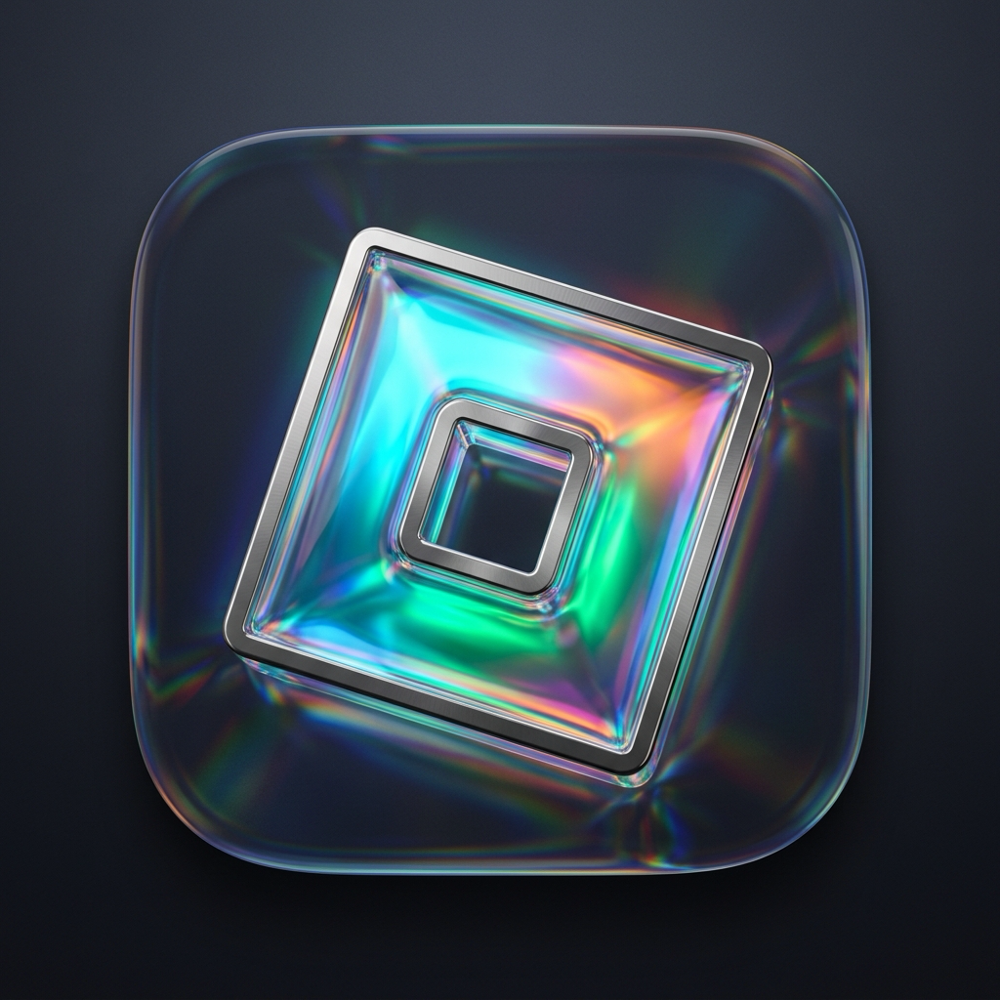

#  RoMacShade for macOS

**RoMacShade** is a native Apple Silicon Metal post-processing shader & ReShade runtime engineered specifically for Roblox on macOS. It compiles supported `.fx` shaders into Metal compute and raster passes, features a draggable floating in-game HUD overlay, hardware ID node-locking, and zero-terminal 1-click launcher.

## 🛡️ Security & macOS Gatekeeper Notice ("Is RoMacShade a virus?")

> [!IMPORTANT]
> **RoMacShade is 100% clean, safe, and contains zero viruses, malware, trojans, or spyware.**

### Why does macOS warn me before opening?
When you download applications from the internet on macOS that are distributed independently (outside the Mac App Store) and without an Apple Developer ID subscription ($99/year), Apple's **Gatekeeper** will display a security dialog on first launch:
> *"“RoMacShade” cannot be opened because Apple cannot check it for malicious software"* or *"macOS cannot verify the developer of “RoMacShade”"*.

This is standard macOS security behavior for any independently developed community software, **not** an indication of a virus or threat.

### How to open RoMacShade on macOS (First time only):
You only need to approve RoMacShade once using either of these quick methods:

- **Method 1 (Recommended — Right-Click Open)**:
  1. Open your **Applications** folder in Finder.
  2. **Right-click (or Control-click)** `RoMacShade.app` and select **Open**.
  3. A prompt will appear asking if you are sure. Click **Open**.
  *(macOS remembers your permission, and you can open RoMacShade normally by double-clicking thereafter).*

- **Method 2 (System Settings)**:
  1. If macOS blocked opening, open **System Settings** &rarr; **Privacy & Security**.
  2. Scroll down to the **Security** section.
  3. You will see: *"RoMacShade was blocked from use because it is not from an identified developer"*.
  4. Click **Open Anyway** and enter your password or Touch ID.

- **Method 3 (Terminal)**:
  If you prefer Terminal, simply remove the quarantine attribute:
  ```sh
  xattr -cr /Applications/RoMacShade.app
  ```

### How RoMacShade Operates Safely:
- **No modification to your installed Roblox**: RoMacShade prepares an isolated, sandboxed copy of Roblox in `~/Library/Application Support/MacShade/Hosts/`. Your original `/Applications/Roblox.app` remains completely pristine and unmodified.
- **Purely Local Metal Graphics**: RoMacShade hooks directly into macOS Metal graphics queues solely to render post-processing shaders. It does not monitor keystrokes, read sensitive data, or transmit information over the network.

---

## Quick Start (Zero-Terminal Setup)

1. Open `RoMacShade.app` from your **Applications** folder.
2. Click **"Launch Roblox with RoMacShade"**.
3. Once in-game:
   - Click the floating circular **'R'** button or press **⌘E** to toggle the effects overlay.
   - Press **⌘B** to quickly toggle all effects on/off for instant comparison.
   - Drag the circular 'R' button anywhere on your screen to reposition it.
   - Use the **Quality** toggle in the overlay header (100% FQ &rarr; 75% &rarr; 50%) to optimize performance on any Mac.

---

## 📱 Looking for Android? Introducing RoAndroidShade!

We now support Android through **RoAndroidShade (`VK_LAYER_RoShade`)**, a native Android Vulkan interceptor layer engineered with full 3D depth-buffer capture for SSR, Bloom, and Ambient Occlusion.
- **🛡️ 100% Safe (No Ban Risk)**: Does not patch, decompile, or repack the Roblox APK, bypassing client signature tamper detection.
- **🔓 No Root Required**: Operates using standard Android 10+ Vulkan GPU Debug Layer settings configured over ADB.
- See the complete Android guide and 1-click install scripts in [Android/README.md](Android/README.md).

---

## Run in Roblox (Command Line / Manual)

Double-click **Launch Roblox with RoMacShade.command** or launch via `RoMacShade.app`. It prepares or reuses a version-specific copy under `~/Library/Application Support/MacShade/Hosts`, starts that copy with the host library, and checks for completed processed frames. The installed `/Applications/Roblox.app` and an already-running official instance remain intact. Allow the first copy operation to finish; logs and a live status JSON are written under `~/Library/Logs/MacShade`.

In the new Roblox window, use the floating **'R'** button or **⌘E** to open the overlay. Choose effects, import an INI, or edit built-in grading. **⌘B** toggles processing for comparison. **Reversed depth input** is available while the controls are open. The host starts with neutral built-in grading. File dialogs are available through the overlay; the host integration adds only the two keyboard shortcuts and leaves Roblox's menu in place.

To launch with a preset from Terminal:

```sh
./"Launch Roblox with MacShade.command" --preset "Presets/Clear Day.ini"
```

The launcher loads at startup into the separate copy; it does not attach to the official instance that is already running. See [HOST_INTEGRATION.md](HOST_INTEGRATION.md) for the tested loading path and exact depth limitation.

## Use the overlay

Open `build/MacShadeDemo.app`. The scene fills the window, and MacShade's native controls appear above it.

1. In **Library**, search the bundled shaders and double-click an effect to add it. **Open .fx…** adds a file directly; **Add folder…** catalogs shaders below a selected folder. Added folder roots are remembered between launches.
2. In **Effects**, select an entry, enable or disable it, move it earlier/later with the arrow buttons, or remove it. Enabled entries run in their displayed order.
3. In **Effect controls**, select the entry's technique and adjust its parameters. The inspector uses reflected labels, tooltips, scalar ranges, boolean switches, choice menus and vector fields where available. **Reset** restores an individual parameter's shader default. Time/frame source uniforms are automatic.
4. In **Built-in look**, adjust exposure, contrast, saturation, vibrance, temperature, tint, sharpening, bloom, vignette and grain.

The built-in look runs **before the FX chain**. Choose **Neutral** there to evaluate an FX preset alone. Resetting the built-in look does not reset FX parameters. The **Effects on/off** control bypasses both stages while retaining their settings.

| Action | Shortcut |
| --- | --- |
| Show/hide overlay | `⌘E` |
| Toggle all effects for comparison | `⌘B` |
| Add an FX file | `⌘O` |
| Import a ReShade preset | `⌘⇧O` |
| Save a preset | `⌘S` |
| Reload effects | `⌘R` |

These actions are also in the **File** menu. **File → Reversed Depth Input** selects the depth direction expected from the host's finite projection; the demo uses forward depth.

Loading compiles a complete replacement chain before installing it. The existing look keeps rendering while a same-size replacement compiles. Resizing recompiles for the new physical-pixel dimensions and pauses rendering until that replacement is ready. Reload/resize preserve compatible edited values, technique selections, order and enabled states; new parameters use shader defaults, and newly compiled effect instances restart their frame counters. Compilation errors appear in the overlay. Save an INI to preserve the FX look between launches; the current chain and built-in settings are not automatically restored.

## Examples and presets

The following files are bundled with the app and also included in the source package:

| File | Purpose |
| --- | --- |
| `Effects/ColorGrade.fx` | Exposure/saturation controls and `ColorGrade`/`Copy` techniques. |
| `Effects/TwoPass.fx` | Two raster passes connected by a named intermediate. |
| `Effects/DepthView.fx` | Inspect captured depth; near/far and display-contrast controls. |
| `Effects/SweetFX/Vibrance.fx` | Upstream SweetFX vibrance shader. |
| `Effects/SweetFX/LumaSharpen.fx` | Upstream SweetFX luminance sharpening shader. |
| `Presets/Clear Day.ini` | A subtle color, vibrance and sharpening chain. |
| `Presets/Soft Cinema.ini` | Reduced saturation with a small exposure lift. |

Use **Import preset** to open either included INI. A preset contains shader references and settings; **it does not bundle its shaders or include files**. For an external preset, add its shader folder to the library first. Keep companion `.fxh` files with their shaders.

The supported INI subset preserves `Techniques`, `TechniqueSorting`, numeric per-effect values, and global/per-effect preprocessor definitions. Import resolves shader filenames beside the preset and in selected library folders. Missing or ambiguous enabled shaders stop the import with a diagnostic. Missing disabled references are skipped with a warning.

Preset import adapts `RESHADE_DEPTH_INPUT_IS_REVERSED` to `0` with a notice, because the capture stage supplies forward depth. Use **File → Reversed Depth Input** to convert a finite reversed host attachment. Shader hotkey assignments are not restored.

On import/reload, disabled entries with resolved files retain their technique/settings without compiling or allocating effect resources until enabled. This accommodates presets whose sorting list contains many inactive techniques. There is a limit of 64 active techniques and 512 listed techniques.

**Save preset** writes the current execution order, enabled states, FX values and definitions. Built-in grading remains separate and is not written into the ReShade INI. Standard presets share uniform values per shader file: export rejects conflicting values across techniques from the same file, or distinct shader files with the same basename. Unsupported configuration fields and input shortcuts are not a promise of full ReShade preset compatibility.

## Depth support and its limits

A selected technique can sample a real `DEPTH` input. The demo writes scene depth, and the hooks capture supported attachments from the same command buffer that presents the color frame. When an active technique needs depth, the hook preserves a compatible attachment's contents and snapshots it after that render encoder ends.

Automatic capture accepts **stored, single-sample 2D `Depth32Float` or `Depth16Unorm` attachments** paired with a same-size color attachment. It converts them into a readable `R32Float` texture. An exact color-texture match is preferred. Otherwise, the hook uses a same-command-buffer heuristic based on aspect ratio and size; this can select the wrong scene pass and is not reliable engine-specific depth discovery.

The expected FX input is forward normalized camera depth, near = 0 and far = 1, in top-left UV orientation. These are perspective depth values, not linear world-space distance. For a **finite** reversed projection, conversion is `1 - rawDepth`; forward input is preserved. The converter does not infer camera planes or rescale depth. Its near/far arguments validate a finite projection; effect-specific depth macros and near/far controls must match the camera convention. ReShade macros may override the input interpretation.

Current automatic capture does not cover MSAA depth, memoryless attachments, combined depth/stencil formats, depth produced in another command buffer or queue, parallel render encoders, or infinite-Z projection conversion. The reversed-input toggle does not make an infinite projection finite. Missing compatible depth produces a diagnostic rather than a fabricated depth image.

An application that knows its renderer can use [MSDepthConverter](Sources/DepthCapture.h) explicitly, or supply its own readable, stored, single-sample `R32Float` depth texture to [MSFXEffect](Sources/FXRuntime.h). Explicit depth can have different dimensions from the color frame; the caller owns synchronization, projection interpretation and source validity.

The depth GPU tests have also exercised a user-supplied qUINT SSR file with its real includes and multipass workload. That shader is not bundled here. This validates that tested input path, not all qUINT effects or correct scene depth in Roblox; see [VALIDATION.md](VALIDATION.md) for current results.

## Build and test

Requires a Metal-capable Mac, macOS 12 or later, and Apple's Command Line Tools. Run from the MacShade directory:

```sh
./build.sh
./build/RendererTests
./build/FXTests
./build/PresetTests
./build/ChainTests
./build/DepthTests
./build/DepthCaptureTests
./build/FXCheck Effects/DepthView.fx
./build/MacShadeDemo.app/Contents/MacOS/MacShadeDemo --smoke
./build/MacShadeDemo.app/Contents/MacOS/MacShadeDemo --smoke --fx Effects/DepthView.fx
./build/MacShadeDemo.app/Contents/MacOS/MacShadeDemo --smoke --preset "Presets/Clear Day.ini"
open ./build/MacShadeDemo.app
```

Launch with a shader or preset:

```sh
./build/MacShadeDemo.app/Contents/MacOS/MacShadeDemo --fx Effects/ColorGrade.fx --technique Copy
./build/MacShadeDemo.app/Contents/MacOS/MacShadeDemo --preset "Presets/Soft Cinema.ini"
```

Use `--fx` or `--preset`, not both. `--technique` selects the single-file startup technique. To exercise an external depth shader with the depth test's explicit input, pass its path to `./build/DepthTests /path/to/qUINT_ssr.fx`.

`FXCheck effect.fx [width height]` compiles source and creates Metal pipelines on the default GPU, then prints techniques and uniform defaults. Dimensions default to 1920 × 1080; each explicit dimension must be 1–16384. Exit codes are `0` for successful compilation, `1` for initialization/compatibility failure and `2` for bad arguments. It does not submit frames or verify depth capture or host integration.

The build produces `build/libMacShade.dylib`, `build/libMacShadeHost.dylib`, `build/MacShadeDemo.app`, `build/FXCheck`, `build/HostProbe`, the independent `build/MetalHostHarness.app`, and the test executables. The demo bundles its dylib, effects and sample presets and is locally ad-hoc signed. `ARCHS="arm64 x86_64" ./build.sh` requests a universal cross-build; [VALIDATION.md](VALIDATION.md) identifies what was actually run.

The compiler sources are vendored, so builds do not download dependencies. The first build can take several minutes. Later builds reuse compiler objects in a task-specific directory under `TMPDIR`, falling back to `/tmp`; `MACSHADE_BUILD_CACHE` overrides that directory. Runtime shader compilation uses the linked compiler without a Vulkan runtime, DXC or glslang.

The GPU tests cover built-in rendering, FX execution, ordered chains, depth inputs and conversion. Preset tests cover parsing/serialization. Demo smoke runs submit 12 actual drawables, cycle all three presentation methods before scene encoding, and require completion without GPU errors. A nonempty enabled FX chain must encode successfully on every smoke frame. Current test counts and observations belong to [VALIDATION.md](VALIDATION.md).

## FX rendering model

The pipeline is **ReShade FX → ReShade SPIR-V generator → SPIRV-Cross Metal source → Metal pipelines**. Each enabled chain entry selects a technique and executes its raster passes; its color result becomes the next entry's input.

Supported features include `COLOR`/`DEPTH` inputs; 2D named intermediate textures; matching-size multiple render targets; viewports; color masks; blending; supported mip generation; sampler filtering/addressing/LOD clamps; and sRGB sampling/writes. Uniforms support scalar/vector bool, signed/unsigned integer and float values. Automatic scalar sources are `timer`, `framecount` and `frametime`; time values are milliseconds.

Named-target formats map to Metal `R8`, `R16`, `R16F`, `R32F`, `RG8`, `RG16`, `RG16F`, `RG32F`, `RGBA8`, `RGBA16`, `RGBA16F`, `RGBA32F`, `RGB10A2` and `RG11B10F`. Device render/filter/mipmap support still applies.

FX color output is **8-bit SDR BGRA/RGBA**, unorm or sRGB, with one sample and one mip level. A regular FX sampler sees stored RGB values; on an sRGB frame those are encoded RGB. An sRGB sampler decodes them, and pass sRGB-write settings control output encoding. Built-in adjustments use Metal's linear sampled values, so their exposure setting need not match an FX exposure control. RGB-only shader outputs preserve destination alpha during the draw; explicit `float4` output controls alpha subject to pass masks, clearing and blending.

The current FX subset excludes compute/storage passes, stencil, external image assets loaded through texture `source` annotations, uniform arrays/matrices/object types, other automatic uniform sources, nonzero sampler LOD bias, 1D/3D textures and HDR FX output. There is no captured normals input or other external semantic beyond `COLOR` and `DEPTH`.

Named intermediates are recreated each frame. Persistent history/temporal effects are unsupported, and sampling a named texture before an earlier pass in the same technique writes it is rejected. Unsupported resources or techniques can reject a whole file even if another technique would work independently. Native controls interpret common annotations; they do not reproduce every ReShade widget or feature.

## Integrating into a Metal host

When the host explicitly loads the dylib, call `MSInstallHooks(&error)` before rendering. `MSSetFXEffects(array)` installs an ordered snapshot of enabled `MSFXEffect` objects; omit disabled entries. `MSSetSettings` controls the built-in look, and `MSSetEnabled` toggles both stages. The single-effect `MSSetFXEffect` API remains available. Recompile effects when drawable dimensions change.

`libMacShadeHost.dylib` adds automatic AppKit integration when loaded with `MACSHADE_HOST_ENABLE=1`. It installs the hooks, discovers a visible Metal-backed window, and attaches the native overlay without replacing the host's delegate or menu. Its interface is [HostOverlay.h](Sources/HostOverlay.h). For explicit integration, compile [Overlay.mm](Sources/Overlay.mm), [FXChain.mm](Sources/FXChain.mm) and [FXPreset.mm](Sources/FXPreset.mm) into your host and connect their action callbacks; the demo illustrates this approach.

When you control rendering, explicit encoding avoids hooks. Set the layer's `framebufferOnly` to `NO` before acquiring drawables, finish scene encoders, then encode the built-in renderer and each FX entry before presenting and committing. For depth, preserve the source attachment and convert it with `MSDepthConverter`, or pass a synchronized forward-depth `R32Float` texture directly. See [MacShade.h](Sources/MacShade.h), [FXRuntime.h](Sources/FXRuntime.h) and [DepthCapture.h](Sources/DepthCapture.h). Do not also install effect hooks for the same drawable, or processing will run twice.

Neither renderer commits, waits for the GPU nor creates another command queue. Encoding success is separate from GPU completion errors. Per-invocation scratch/uniform resources survive completion, including for unretained-reference buffers. The built-in renderer also accepts RGBA16Float and preserves HDR headroom; that capability does not extend to FX.

## Hook boundaries

The layer hook disables framebuffer-only allocation. Presentation hooks record drawables and immediately forward original timing requests. At commit, built-in and FX passes are appended to the same command buffer. When depth is needed, render-encoder hooks preserve/copy supported attachments after encoding and associate the captures with that buffer.

Hooks are process-wide and observe the default Metal device's command-buffer class; they do not filter by window. They do not cover other driver classes, overriding custom classes, direct drawable `present` calls, Metal 4 submission APIs or concurrent encoding into one buffer. Swizzling Metal implementation objects is not an Apple-supported plugin interface. Keep the dylib loaded for the process lifetime; there is no unhook/unload API.

`MSProcessedFrameCount()` counts built-in encoding; `MSProcessedFXFrameCount()` counts a drawable once only when every effect in its nonempty chain encodes successfully. `MSDepthCaptureCount()` counts depth snapshots, which may outnumber frames. These are not displayed-frame or GPU-completion counts. `MSLastDepthStatus()` exposes capture diagnostics. Disabling effects leaves hooks installed and framebuffer-only optimization disabled.

`MACSHADE_AUTOLOAD=1` requests deferred installation on the main queue after a compatible host has loaded the dylib. It neither loads the library itself nor changes host security settings.

## Roblox compatibility

The tested Roblox 0.739.0.7390687 copy loads the host library and processes its Metal drawable render targets before their command buffers commit. The overlay controls actual Roblox output: a saturation edit produced grayscale output, and the GPU completion counters advanced without errors. The tested official process remains unchanged. The launcher's local signing configuration applies only to its copy.

The installed player has hardened runtime enabled and lacks the allow-DYLD-environment-variables and disable-library-validation entitlements. Its ordinary task-port request was also denied by macOS. The launcher preserves existing entitlements, adds those two loading exceptions to an isolated copy, and ad-hoc signs that copy. See [HOST_INTEGRATION.md](HOST_INTEGRATION.md), Apple's [library validation documentation](https://developer.apple.com/documentation/bundleresources/entitlements/com.apple.security.cs.disable-library-validation), and [DYLD environment-variable protection](https://developer.apple.com/documentation/bundleresources/entitlements/com.apple.security.cs.allow-dyld-environment-variables).

The tested avatar preview does not provide a depth attachment that the current same-command-buffer matcher can associate with the final drawable. qUINT SSR compiles but is skipped there. The overlay reports **Waiting for scene depth**. Testing a shader in the demo does not establish Roblox camera/depth compatibility, and other Roblox versions or in-experience render paths still need verification.

The supplied `libswift_Concurrency.dylib` is Apple's signed Swift runtime; the inspected graphics mod is `MaxeysVisuals.framework/MaxeysVisuals`. MacShade combines newly written Mac code with upstream shader compilers. It does not reproduce every feature or the precise output of that iOS framework. The inspected iOS binaries were not executed or modified.

## Third-party sources and licenses

- ReShade FX compiler: [BSD 3-Clause](ThirdParty/ReShadeFX/LICENSE.md). The pinned revision and Apple portability patches are in [UPSTREAM.txt](ThirdParty/ReShadeFX/UPSTREAM.txt).
- SPIRV-Cross: [Apache 2.0](ThirdParty/SPIRV-Cross/LICENSES/Apache-2.0.txt) or [MIT](ThirdParty/SPIRV-Cross/LICENSES/MIT.txt), as identified in source headers.
- Included SweetFX shaders: [MIT](Effects/SweetFX/SweetFX-LICENSE). Their companion ReShade include files declare CC0-1.0; pinned provenance is in [SOURCES.txt](Effects/SweetFX/SOURCES.txt).

Keep applicable notices and license files with redistributed copies.
